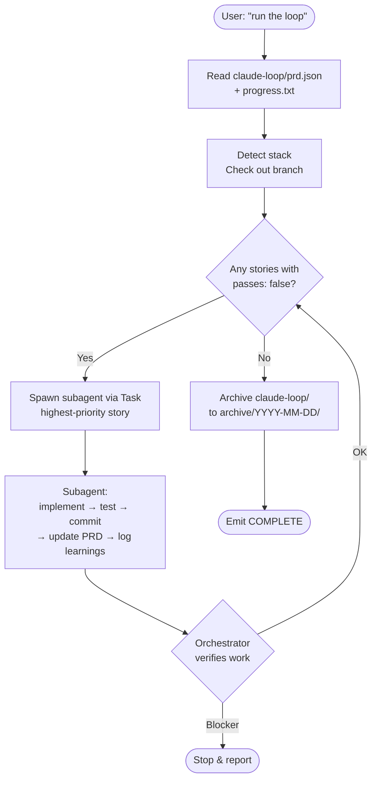

# Claude Loop

> Hand Claude a PRD. Get a working feature back. One story per subagent, fresh context every time.

Claude Loop is a [Claude Code](https://docs.anthropic.com/en/docs/claude-code) skill that drives an autonomous coding workflow. You write a `prd.json` listing the user stories you want shipped; Claude works through them one by one, spawning a fresh subagent (via the `Task` tool) for each story. Each subagent implements its story, runs your tests, commits the work, and exits — so context never piles up across a long run.

The state of the run lives in `claude-loop/`. The skill code lives in `.claude/skills/claude-loop/`. That's it — no scripts, no daemons, no external orchestrator.

## Why

Autonomous coding sessions degrade as context fills up. Long runs forget earlier decisions, repeat mistakes, and produce sloppier code as the window stretches. The usual workarounds — chunking the work, summarizing midway, hoping for the best — leak context anyway.

Claude Loop sidesteps the problem entirely. Each story gets a fresh subagent. Memory persists through three durable channels:

- **Git history** — every story produces a clean, focused commit
- **`progress.txt`** — append-only log of learnings (with a `## Codebase Patterns` section at the top for general rules)
- **`AGENTS.md` files in the source tree** — auto-read by Claude in any directory it works in, so per-module knowledge compounds where it's most useful

The result: arbitrarily long runs that don't degrade.

## Prerequisites

- [Claude Code](https://docs.anthropic.com/en/docs/claude-code) installed and authenticated
- A git repository for your project
- Bonus points: Your project has a typecheck and/or test command (auto-detected for npm, pip, cargo, go)

## Install

**Per-project:**

```bash
git clone https://github.com/YOUR-USER/claude-loop.git .claude/skills/claude-loop
mkdir -p claude-loop
```

**Global (use across all your projects):**

```bash
git clone https://github.com/YOUR-USER/claude-loop.git ~/.claude/skills/claude-loop
```

The skill auto-loads in any Claude Code session inside a project where it's installed. For global installs, `claude-loop/` is created the first time you run the loop in a project.

## Quick start

1. Create `claude-loop/prd.json` at your project root. See [`prd.example.json`](./prd.example.json) for the shape.
2. Open Claude Code in your project.
3. Say one of:
   - **"run the claude loop"**
   - "work through the prd"
   - "process prd.json"
4. Claude reads the PRD, detects your stack, checks out the branch from `branchName`, and starts spawning subagents.
5. When all stories pass, the run archives itself to `claude-loop/archive/YYYY-MM-DD-<branchName>-complete/` and Claude emits `<promise>COMPLETE</promise>`.

## How it works



Two roles, one Claude Code session:

- **Orchestrator** (the main Claude session): reads the PRD, manages the git branch, spawns subagents via `Task`, verifies their output, archives when done. Never touches application code itself.
- **Subagent** (one fresh `Task` invocation per story): implements one story, runs checks, commits, updates the PRD, logs learnings, exits.

Subagents run **sequentially**, never in parallel — stories often touch overlapping files, and parallel execution would race on git, the PRD, and `progress.txt`.

## The PRD

`claude-loop/prd.json` is the task list. Minimal shape:

```json
{
  "project": "MyApp",
  "branchName": "feat/wagering-history",
  "description": "User Wagering History - Persist and display each user's past wagers",
  "userStories": [
    {
      "id": "WAGER-001",
      "title": "Add wagers table to database schema",
      "description": "As a developer, I need a database table to store wager records so we can persist user wagers across sessions.",
      "acceptanceCriteria": [
        "Migration creates a `wagers` table with id, userId, amount, outcome, createdAt",
        "Foreign key to users table",
        "Index on userId",
        "Typecheck passes"
      ],
      "priority": 1,
      "passes": false,
      "notes": ""
    }
  ]
}
```

The shape mirrors [Ryan Carson's Ralph](https://github.com/snarktank/ralph) `prd.json` so PRDs are portable between the two tools.

- `project` — short project name (free-form)
- `branchName` — git branch the work happens on (auto-created from `main` if missing)
- `description` (top-level) — one-line feature summary
- `userStories[].description` — single string, typically in "As a X, I want Y so that Z" form
- `priority` — lower number = higher priority, processed first
- `passes` — starts `false`, flipped to `true` when the story commits
- `notes` — free-form scratchpad; subagents may append context here (e.g. blockers, partial progress)
- `acceptanceCriteria` — explicit and testable. **The richer these are, the better the implementation.** If a constraint isn't here, the subagent won't enforce it.

See [`prd.example.json`](./prd.example.json) for a full example with three stories of varying types.

## Where state lives

Three distinct locations inside your project — keep them straight:

| Location | What it is | Who writes to it |
|---|---|---|
| `.claude/skills/claude-loop/` | The skill code | Nobody during a run (installed once) |
| `claude-loop/` | Runtime state — PRD, progress log, branch tracking, archive | Orchestrator and subagents |
| `AGENTS.md` files in source tree | Per-module knowledge, auto-read by Claude in each directory | Subagents, when they discover reusable patterns |

`AGENTS.md` files live next to the code they describe (project root, module directories) — never inside `.claude/`. That placement is what makes them auto-load.

**Why `claude-loop/` sits at the repo root, not in `.claude/`:** Claude Code treats every write under `.claude/` as sensitive and asks you to confirm it (that's where settings, hooks, and skills live). The loop rewrites `prd.json` and appends `progress.txt` on *every* story, so keeping runtime state in `.claude/` means a confirmation prompt on every single story — death by a thousand clicks on a long autonomous run. A top-level `claude-loop/` is covered by ordinary `Read`/`Edit`/`Write` permissions, so runs proceed uninterrupted. The skill *code* stays in `.claude/skills/claude-loop/` because it's read-only while the loop runs.

A populated project looks like:

```
your-project/
├── .claude/
│   └── skills/claude-loop/         # skill code (installed once)
├── claude-loop/                    # runtime state (created on first run)
│   ├── prd.json                    # your task list
│   ├── progress.txt                # learnings log
│   ├── .last-branch                # state tracking
│   └── archive/                    # past runs
├── AGENTS.md                       # project-level conventions
├── src/
│   ├── auth/AGENTS.md              # module conventions
│   └── ...
```

## Key principles

**Small stories.** Each story must fit in one subagent's context window. "Add a column and a migration", "add a server action", "add a UI list component" all work. "Build the dashboard" and "refactor the API" don't — split them first. If a subagent reports a story is too large, the orchestrator stops; the PRD needs revision before retrying.

**CI must stay green.** Subagents refuse to commit if checks fail. The orchestrator stops on the first blocker rather than compounding errors across iterations. A broken commit poisons every future subagent.

**`AGENTS.md` is where knowledge compounds.** When a subagent discovers a non-obvious convention or gotcha (e.g. "when modifying X, also update Y to keep them in sync"), it records it in the closest `AGENTS.md` in the source tree. Future subagents auto-read these. This is more durable than burying it in `progress.txt`.

**Sequential, never parallel.** Stories overlap on files. Sequential execution keeps git, the PRD, and `progress.txt` consistent. There is no "speed up by running stories in parallel" mode by design.

## Stack support

The orchestrator detects your project's typecheck and test commands automatically and embeds them in the subagent prompt:

| Project signal | Typecheck | Test |
|---|---|---|
| `package.json` + `tsconfig.json` | `npm run typecheck` (or `npx tsc --noEmit`) | `npm test` |
| `package.json` (JS only) | — | `npm test` |
| `pyproject.toml` / `setup.py` | `mypy` if configured | `pytest` |
| `Cargo.toml` | `cargo check` | `cargo test` |
| `go.mod` | `go build ./...` | `go test ./...` |

If your project uses a custom build system (Bazel, Buck, a `Makefile`, a `justfile`), the orchestrator reads what it can and asks you for the right commands if it's unsure. To hardcode them, edit [`subagent-prompt.md`](./subagent-prompt.md) and replace the `[TYPECHECK_CMD]` / `[TEST_CMD]` placeholders with literals.

## When it stops

- **All stories pass** → archive run, emit `<promise>COMPLETE</promise>`.
- **Subagent blocker** (failed checks, missing tools, ambiguous requirements, story too large) → orchestrator stops, summarizes the blocker, waits for your direction.
- **You stop Claude manually** → no state corruption. The next invocation picks up from the next `passes: false` story. The PRD is the source of truth; the run can resume any time.

The orchestrator does not auto-retry failed subagents. A clean stop with a clear report beats compounding errors.

## Customizing

Most projects need zero configuration. To tune:

- **Codebase conventions:** add an `AGENTS.md` at your project root with global rules. Subagents read it every iteration.
- **Stack commands:** edit [`subagent-prompt.md`](./subagent-prompt.md) if auto-detection doesn't fit.
- **Subagent contract:** add project-specific rules to `subagent-prompt.md` (commit message conventions, mandatory linters, required reviewers, etc.).

## Git: what to commit

Sensible defaults:

- **Commit** `.claude/skills/claude-loop/` so your team gets the skill automatically.
- **Commit** `claude-loop/prd.json` so the PRD is version-controlled with the feature branch.
- **Commit** `claude-loop/progress.txt` and `claude-loop/archive/` if you want the learnings shared.
- **Gitignore** `claude-loop/.last-branch` (local state).

Or gitignore `claude-loop/` entirely and treat it as a personal workspace — both approaches work.

## FAQ

**Why not just run Claude Code in one long session?**
Context degrades as it fills. Fresh subagents per story keep each implementation crisp regardless of how many stories you've shipped. The orchestrator's context is also small — it only holds high-level state, not implementation details.

**Why not run subagents in parallel for speed?**
Stories typically touch overlapping files. Parallel subagents would race on `git`, the PRD, and `progress.txt`. The single-context-window-per-story constraint is what makes the workflow reliable; speed isn't the goal.

**My PRD has 30 stories. Is that fine?**
Yes — there's no upper limit on stories. Each one is independent. The constraint is on individual story size, not total story count.

**Can I resume after stopping?**
Yes. The PRD is the source of truth. On the next invocation, the orchestrator picks up from the next `passes: false` story. If you switched branches mid-run, the orchestrator archives the abandoned run to `claude-loop/archive/` before starting fresh.

**Does this work with the Claude API directly?**
No — it requires the `Task` tool, which is specific to Claude Code (and Claude.ai with subagents). The skill auto-loads in those environments.

**What if a story keeps failing?**
The orchestrator stops on a blocker and reports it; it does not auto-retry. Usually the fix is to split the story or sharpen the acceptance criteria, then re-run.

## Files

- [`SKILL.md`](./SKILL.md) — orchestrator instructions (auto-read by Claude when the skill triggers)
- [`subagent-prompt.md`](./subagent-prompt.md) — template passed to each subagent via `Task`
- [`prd.example.json`](./prd.example.json) — reference PRD shape
- `README.md` — this file

## License

MIT. See [LICENSE](./LICENSE).
